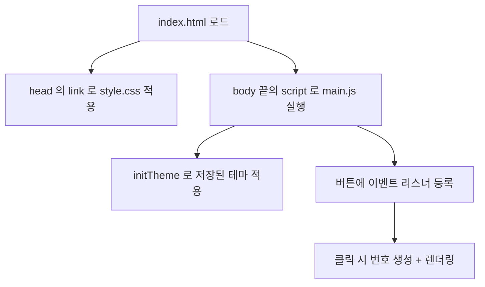

# 01 - 파일 구조

## 폴더 트리

```text
product-builder-lecture/
├── index.html      # 화면 뼈대 (HTML)
├── style.css       # 디자인 · 테마 · 애니메이션 (CSS)
├── main.js         # 동작 로직 (JavaScript)
├── blueprint.md    # 원본 기획 문서
└── obsidian/       # ← 이 참조 노트들
```

## 로드 순서와 의존 관계

브라우저가 `index.html` 을 열면 다음 순서로 리소스를 불러옵니다.



핵심 포인트:

- `style.css` 는 `<head>` 의 `<link>` 로 연결됩니다. → [[02 - HTML 구조]]
- `main.js` 는 `<body>` **맨 끝**의 `<script>` 로 불러옵니다.
  DOM 요소가 모두 만들어진 뒤 실행되므로 `getElementById` 가 안전하게 동작합니다.

## 각 파일의 책임 (관심사 분리)

| 파일 | 책임 | 관련 노트 |
| --- | --- | --- |
| `index.html` | **구조** — 어떤 요소가 있는가 | [[02 - HTML 구조]] |
| `style.css` | **표현** — 어떻게 보이는가 | [[03 - CSS 스타일링]] |
| `main.js` | **동작** — 무엇을 하는가 | [[04 - JavaScript 로직]] |

이 3계층 분리는 → [[05 - 핵심 개념 정리#관심사 분리]] 에서 더 다룹니다.

#구조 #아키텍처
